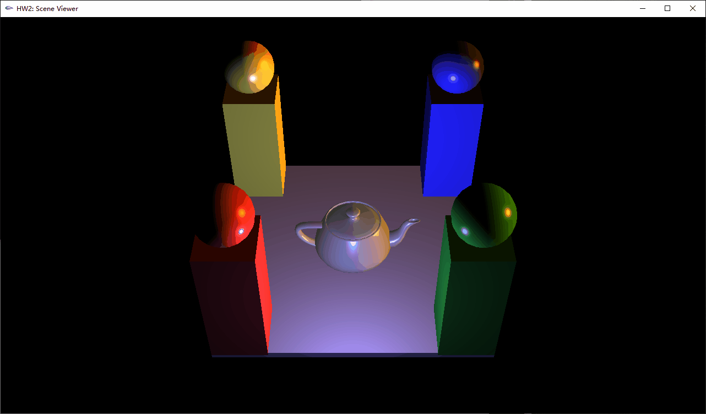

## Description
a simple scene viewer using OpenGL.

The program take an input scene description that specifies the camera, scene width and
height, lights, object geometry (spheres, teapots, and cubes) and material properties, and
render this scene with correct camera positioning and lighting(phong shading)

## Usage
enter the scene file name when prompted, then in the scene viewer press:
* `arrow keys` to rotate around the scene
* `+` or `-` to change the amount of rotation that occurs with each arrow press.
* `g` to switch between using glm::lookAt and glm::Perspective or my own LookAt.
* `r` to reset the transformations.
* `v` `t` `s` to do view (default), translate, scale.

## Scene
scene file `demo.txt`
